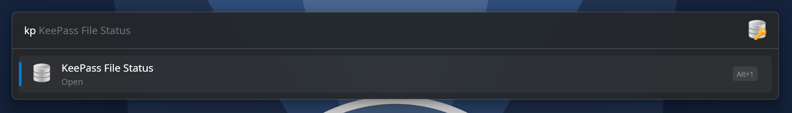
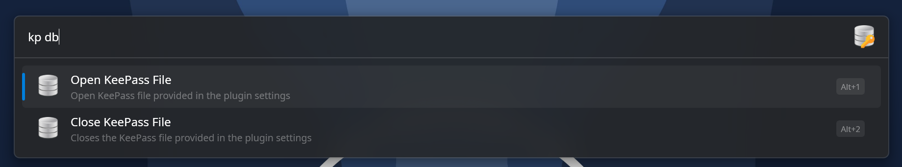
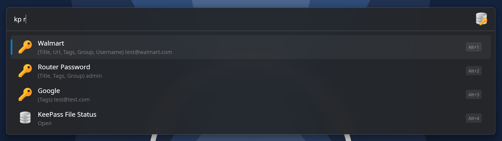
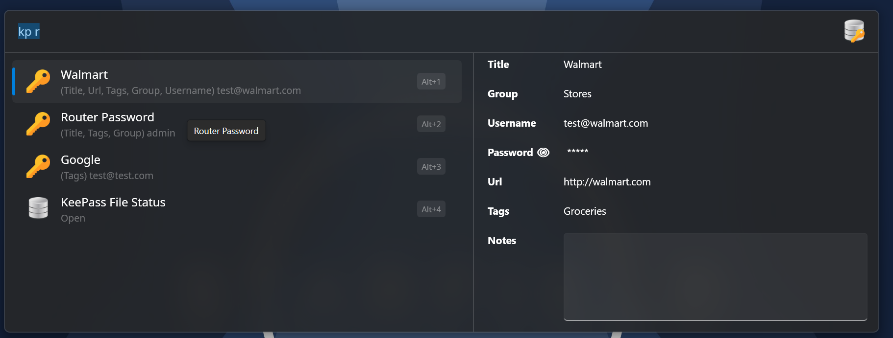
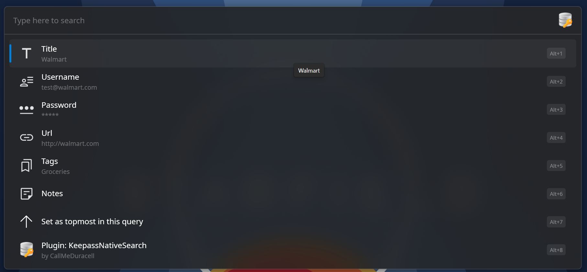
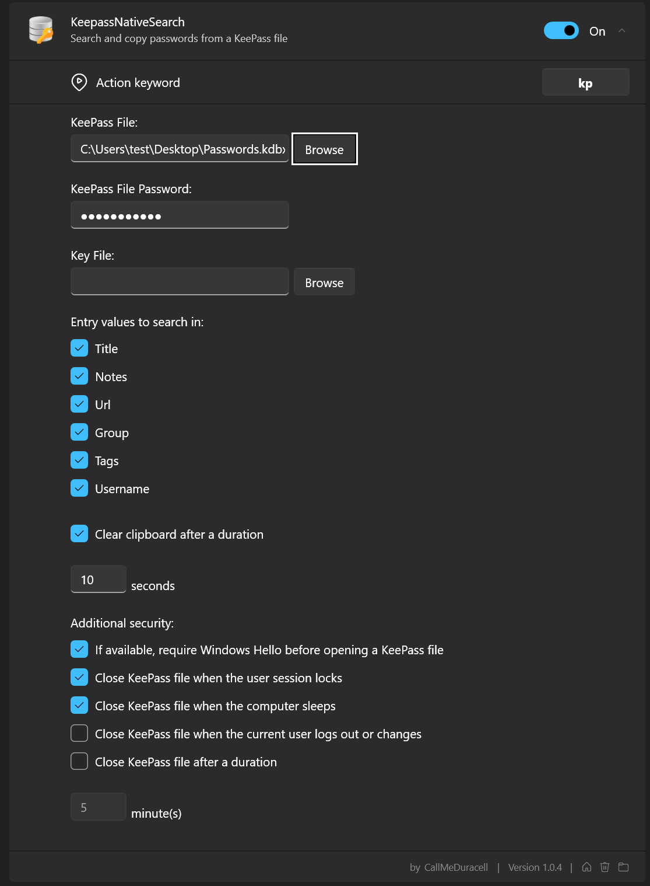

#  KeepassNativeSearch
A [Flow Launcher](https://www.flowlauncher.com) plugin to streamline the process of finding KeePass file entries and to teach me more about C#.


## Overview
KeePassNativeSearch is a Flow Launcher Plugin that enables querying a local KeePass database for its contents directly from the search menu.

## Features

### File Status
Quickly see the status of the KeePass file (open or closed) by typing in the plugin action keyword.

### File Control
`Action Keyword db` allows you to quickly open or close the KeePass file defined in settings.

### Read File Entries
Quickly see KeePass entries by keyword search with titles, username, and fields where the keyword was found in Flow Launcher results.

### Copy passwords
Copy password on entry results by selecting the result in Flow Launcher.

### Query Fields
Select any number of entry fields to search keywords against. 

### Entry Previews
Show KeePass file entry metadata neatly organized in a result preview.

### Context Menu
Quickly see and copy entry fields through the result context menu.

### Windows Hello
Optioanlly require Windows Hello authentication before a KeePass file can be opened

### Clipboard Clearing
Optionally clear the clipboard after a number of seconds.

### Automatic Session Locking
Optionally close the database if the logged in user locks the computer screen, logs out, or the user profile switches.

### Open File Timeouts
Optionally close a KeePass file after a duration in minutes.

### User Scoped Password Encryption
The KeePass file password is encrypted in Flow Launcher settings, scoped to the user and computer in which the plugin resides. It can't be leaked to other users or utilized by stealing the plugin settings for use on another computer.

### Notifications
Status notifications for opening and closing files, as well as copying entries.

## Screenshots
### Status


### Controls


### Entries


### Previews


### Context Menu


### Settings


## Supported KeePass File Features
* Read KDBX 3.x and 4.x databases
* Read databases with a password, a key file, or both
* Support AES-128/256-CBC, ChaCha20, and Twofish-256-CBC encryption
* Supports AES-KDF, Argon2d, and Argon2id
* GZip compression and protected XML values

## Building
Building KeepassNativeSearch only requires the .NET SDK version 9.0 or greater with the ability to pull required nuget packages.

```
dotnet build KeepassNativeSearch.sln --configuration <Debug or Release>
```

## Create Flow Launcher Compatible Release
Execute the publish command on the solution.

```dotnet publish KeepassNativeSearch.sln -c Release```

 A zip file called KeepassNativeSearch-v(version).zip will be created with the complete plugin release in the publish directory. By default, that location is `...\KeepassNativeSearch\KeepassNativeSearch\bin\Release\net9.0-windows10.0.22621.0`

# Installing
Unzip the contents of the published plugin from the step above to a folder in the `Plugins` directory of your Flow Launcher `userdata` location. `userdata` can be determined by opening Flow Launcher, typing `userdata` and selecting the result that appears titled "Flow Launcher UserData Folder"

# Acknowledgements
Special acknowledgement go out to the kepass-dotnet project for providing the C# library to easily open and read KeePass files (https://github.com/pidamg/keepass-dotnet). Any functionality directly related to this plugin's ability to work with KeePass files comes from this library.

Flow Launcher, which is an amazing Quick File Search & App Launcher for Windows (https://flowlauncher.com)

KeePass, the original developer of the file format (https://keepass.info)

KeePassXC, my favorite KeePass client (https://keepass.org)
